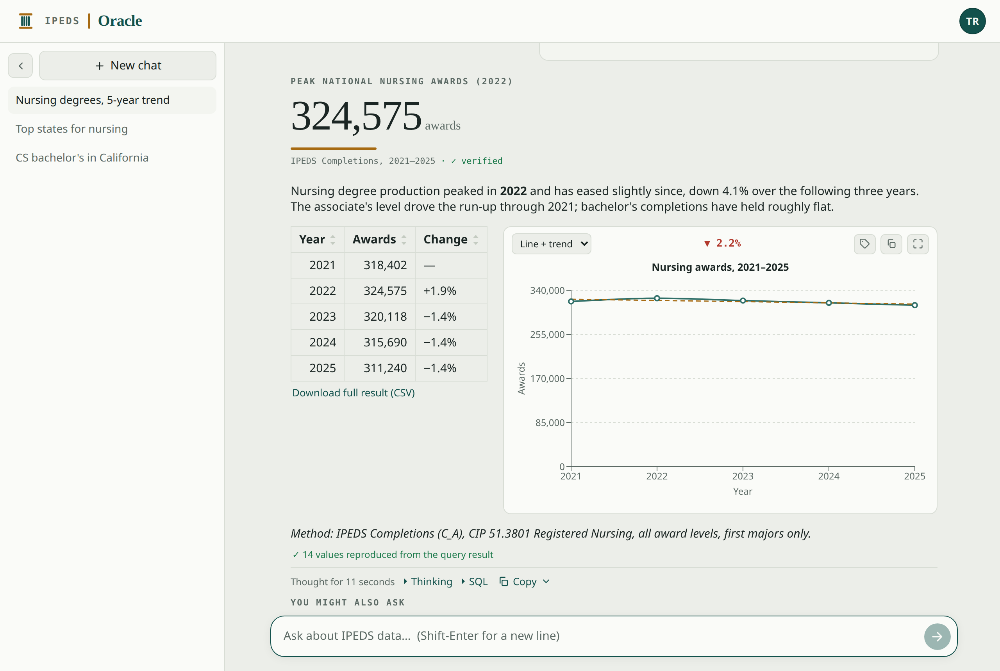

# IPEDS Oracle

[](https://github.com/toddawhittaker/ipeds-oracle/actions/workflows/ci.yml)
[](LICENSE)

Ask questions about U.S. colleges and universities in plain English and get
back conversational answers with tables and charts — no SQL, no spreadsheets.

It's a private, invitation-only web app for exploring **IPEDS** (the U.S.
Department of Education's annual census of colleges) across recent collection
years: degrees awarded, enrollment, tuition and financial aid, graduation and
outcome rates, admissions, and institutional details.

> **Why "Oracle"?** Nothing to do with the database or cloud company. The name
> is a nod to the **Oracle of Delphi** of Greek mythology — the place you went
> with a question and came away with an answer.



*One question, answered: a hero figure, a short summary, the table and chart
behind it, and suggested follow-ups. See the [User guide](docs/USER_GUIDE.md) for
a full tour, or the [Admin guide](docs/ADMIN_GUIDE.md) for the admin console.*

> **Just want to use it?** Read the rest of this page.
> **Self-hosting it?** See [Self-hosting](#self-hosting) below.
> **Working on the code?** See [CONTRIBUTING.md](CONTRIBUTING.md).

---

## What you can ask

Type questions the way you'd ask a colleague. A few to get you started:

- "Top 20 institutions awarding Associate's degrees in Registered Nursing over
  the last 3 years."
- "How many Computer Science bachelor's degrees did California public
  universities award last year?"
- "Which states awarded the most Master's degrees in Education?"
- "Show me a graph of nursing degrees awarded nationally over the last 5 years."
- "In a 60‑mile radius of Columbus, Ohio, the top 5 universities graduating MBA
  students over 5 years."

You don't need to know program codes or table names — just describe what you
want. The assistant figures out the query, runs it, sanity‑checks the numbers,
and explains the answer.

## Signing in

Access is by invitation. On the sign‑in page, enter your email:

- If you've been approved, you'll get a **one‑time sign‑in link** by email — no
  password to remember. Click it and you're in for about a month.
- If you haven't been approved yet, you can **request access**, and an
  administrator will be notified.

## Using it

Ask a question in the box at the bottom and watch the answer stream in.

- **Answers** lead with the direct result, then a compact table, then a short
  note on how it was calculated. Expand **Thinking** to see the steps and the
  exact SQL the assistant ran. Suggested follow-ups appear below; one click asks
  the next question.
- **"Did you mean"** — if a question could reasonably be read two ways that would
  change the headline number (bachelor's-only vs. every award level, say), the
  assistant asks a short clarifying question with one-click answers instead of
  quietly picking one.
- **Tables** — each result table has its own CSV button and **Chart this** when
  the data suits a graph. Click a column header to **sort**; long tables scroll
  with a pinned header. A big result is shown as a **page** — captioned *"First
  200 rows · the full result is larger"* — and the button says which data you
  get: **Download full result (CSV)** re-runs the query server-side for the
  complete set, while **Download these N rows (CSV)** exports just what's on
  screen.
- **Charts** — pick the chart type (**Line**, **Bar**, or **Line + trend**),
  toggle **data labels**, **maximize** for a bigger view, and **copy the image**
  to paste straight into an email, doc, or slide (clean in light or dark mode).
  Tick 2–4 rows of a ranking table to **compare** just those, charted instantly
  from the numbers already on screen.
- **Copy** a whole answer as **Markdown** or **rich HTML** (the HTML keeps the
  table and chart formatting when pasted into Word, Outlook, or Google Docs).
  Copy takes the answer **as displayed**, so on a paged result use the full-result
  CSV instead.
- **Checked numbers** — where the app can reproduce an answer's numbers from the
  rows its own query returned, it says so: a **✓ verified** on a hero figure, and
  a line under a table counting the values that reproduced. Where some didn't, it
  asks you to **check them against the SQL or CSV** — a prompt to look, not a
  claim that anything is wrong.
- **Edit** or **Rerun** any of your earlier prompts to refine a question — the
  new answer replaces the old one in place. Re-asking a question part-way up the
  conversation also removes the exchanges below it (they followed from it), so
  the app confirms first and says how many.
- **Conversations** are saved in the sidebar (named automatically), and you can
  rename or delete any of them. Collapse the sidebar for more room. A question
  still running keeps working if you navigate away — come back and you'll see it
  in progress, then the answer.
- **Your account menu** — the avatar in the top-right holds **light/dark mode**
  (remembered), **About**, **Sign out**, and **Admin** for administrators.

A repeat of a near‑identical question may return instantly from a cache, but the
numbers are always re‑checked against the live data.

## Data coverage & accuracy

Each deployment chooses which IPEDS collection years it loads, so the coverage is
whatever your administrator has integrated — the app states the loaded range on
the start screen rather than assuming one. When a new year is published, an
administrator loads it and the app picks it up automatically, no restart.

The assistant sanity‑checks magnitudes before answering (for example, ~1 million
associate's degrees are awarded nationally per year), but it's a tool, not an
oracle — for anything you'll publish or make a decision on, spot‑check the
result, and use **Download CSV** or **Thinking → SQL** to verify the underlying
numbers.

## For administrators

Signed‑in admins get an **Admin** entry in the account menu:

- **Users** — approve, promote, or remove people across three sub‑tabs (current
  users, pending requests, blocked addresses), one at a time or in bulk.
- **Imports** — pick years from a live NCES catalog, or upload a year's IPEDS
  file; it builds and validates in the background and swaps in only if the checks
  pass (the live data is never disturbed mid‑import). Integrated years can be
  removed again.
- **Usage** — queries, tokens, and **spend** over a chosen time range
  (hour / day / 7 / 30 days / custom), with a chart and per‑user breakdown, plus
  the data‑integrity rates (how many answers' figures and table cells could be
  reproduced from the query results).
- **Skills** — review and curate the lessons the assistant has learned.
- **Logs** — recent server activity.

Wherever something is waiting — access requests, unverified lessons, new problems
in the logs, an available update — a **count badge** appears on the avatar and on
the relevant Admin section, and clears when you act on it.

The [Admin guide](docs/ADMIN_GUIDE.md) covers all of this in depth.

## Under the hood

A FastAPI backend runs an embedded, tool‑calling AI agent over a read‑only
SQLite copy of the IPEDS data; a React front end renders the chat, tables, and
charts. It's designed to be cheap to run and safe by construction — the model
can only issue read‑only queries, bounded by a timeout, a row cap, and a
per‑value size cap. Answers are additionally checked after the fact: a
deterministic pass tries to reproduce each answer's hero figure and table cells
from the rows the queries actually returned, which is what the ✓ mark and the
Admin → Usage integrity rates report. Details in
[CONTRIBUTING.md](CONTRIBUTING.md) and [Self-hosting](#self-hosting) below; the
data model and query conventions are documented in [SCHEMA.md](docs/SCHEMA.md).

## Self-hosting

IPEDS Oracle runs as a single container (or a plain Python process). You bring
your own LLM + email keys and the built `ipeds.db`.

### Requirements

- **Docker** with Compose (or Python 3.12 for a from‑source run — see
  [CONTRIBUTING.md](CONTRIBUTING.md)).
- An **OpenRouter** API key (or any OpenAI‑compatible provider).
- **Email delivery** for the magic‑link and access‑request emails — either a
  **Resend** API key (easiest for a pilot) **or your own SMTP** (Google Workspace,
  Microsoft 365, or any relay). See [Email](#email) below.
- **Outbound HTTPS to `nces.ed.gov`** — the Admin → Imports year catalog fetches
  IPEDS releases from there. Without it the catalog degrades gracefully and the
  manual `.accdb` upload still works. No other outbound access is required.

### Run

```bash
git clone https://github.com/toddawhittaker/ipeds-oracle && cd ipeds-oracle
cp .env.example .env && $EDITOR .env    # LLM_API_KEY, RESEND_API_KEY, ADMIN_EMAILS, APP_PUBLIC_URL, …
mkdir -p srv-data/accdb                  # the /data volume (holds the DBs + import sources)
cp /path/to/ipeds.db srv-data/ipeds.db   # the built database (see "Data" below)
docker compose up -d --build             # --build until you pull a published image
```

Open the app, sign in with an address in `ADMIN_EMAILS` (auto‑allowlisted + admin
on first boot), and add colleagues under **Admin → Users**. Update later with
`docker compose pull && docker compose up -d` (pin a release via `IPEDS_TAG`).

### Data

The app serves a read‑only `ipeds.db`. Either drop a prebuilt one into the `/data`
volume (`srv-data/ipeds.db`), or start with none and build the first year through
**Admin → Imports** (it fetches from NCES, or accepts an `.accdb` upload). Keep the
source `.accdb` files under `srv-data/accdb/` for later re‑imports. `ipeds.db` is
rebuildable, so it is **not** backed up — and the previous copy is deleted as soon
as an import or year‑removal swaps a new one into place, rather than leaving a
second full dataset on disk.

**Backups are yours to run.** `app.db` (users, chats, learned skills) is the
irreplaceable state, and the app deliberately does **not** schedule its own
backups — snapshot the bind‑mounted volume on whatever cadence you already use
for the host, or run `scripts/backup_app_db.py` from your own cron (it takes a
consistent online snapshot and can push off‑site to any S3‑compatible store via
rclone; set `BACKUP_REMOTE`). The one thing the app does automatically is
snapshot `app.db` **before applying migrations** on an upgrade, keeping the two
most recent (`app.db.pre-v<N>`), so a bad upgrade is reversible. That is an
upgrade safety net, not a backup: it does nothing for ordinary data loss.

> **Rolling back to an older image refuses to start** — deliberately. Migrations
> are forward-only, so once `app.db` has been upgraded, an older build cannot
> understand its schema; rather than run against it and silently write damage
> into your irreplaceable state, the app logs a CRITICAL naming both versions and
> exits. To actually go back, restore the matching `app.db.pre-v<N>` snapshot
> alongside the older image.

### HTTPS

The app listens on **:8000**. Give it TLS one of two ways:

1. **Behind a reverse proxy or tunnel** (recommended for anything public) — let
   your proxy/tunnel terminate TLS and forward to `:8000`. Set `APP_PUBLIC_URL` to
   your public URL and `TRUSTED_PROXY_COUNT` to the number of proxy hops.
   `TRUSTED_PROXY_COUNT` is the *only* thing that should interpret
   `X-Forwarded-For`, so the container runs uvicorn with `--no-proxy-headers`
   (uvicorn would otherwise trust the header itself whenever the proxy connects
   over loopback, letting a client spoof its own address past the per-IP limit).
   If you run the app outside the published image, pass that flag yourself.
2. **Direct HTTPS with a self‑signed cert** (handy on a LAN) — generate a cert and
   point the app at it:

   ```bash
   scripts/gen-selfsigned-cert.sh certs your-host   # writes certs/cert.pem + key.pem
   ```

   Uncomment the `./certs:/certs:ro` mount in `compose.yaml`, and in `.env` set
   `SSL_CERTFILE=/certs/cert.pem`, `SSL_KEYFILE=/certs/key.pem`, and
   `APP_PUBLIC_URL=https://your-host:8000`. Browsers warn until you trust the cert.

Either way keep `COOKIE_SECURE=true` — the session cookie is only sent over HTTPS.

### Email

The app sends one‑time sign‑in links, access‑request notices, and approval
welcomes. `MAIL_BACKEND` chooses how (default `auto`):

- **Resend** (`RESEND_API_KEY`) — a hosted email API; the quickest way to stand up
  a pilot. Needs a verified sending domain in Resend.
- **SMTP** (`SMTP_HOST` + friends) — your own mail infrastructure. Point it at
  **Microsoft 365** (`smtp.office365.com:587`, STARTTLS), **Google Workspace**
  (`smtp-relay.gmail.com:587`, or `smtp.gmail.com:587` with an app password), or
  any relay. Auth is skipped when `SMTP_USERNAME` is empty (IP‑authed relays).
- **console** — no send; the message (including the sign‑in link) is written to
  the log. Handy for local dev without any provider.

`auto` picks Resend if a key is set, else SMTP if `SMTP_HOST` is set, else console.
`MAIL_FROM` must be an address the chosen backend is allowed to send as. See
[`.env.example`](.env.example) for every SMTP option.

### Configuration

All settings come from `.env` — see [`.env.example`](.env.example) for the full,
commented list. The essentials:

| Variable | What |
| --- | --- |
| `LLM_API_KEY` / `LLM_BASE_URL` | LLM provider (OpenRouter by default) |
| `MAIL_BACKEND` / `RESEND_API_KEY` / `SMTP_*` / `MAIL_FROM` | email delivery (see [Email](#email)) |
| `ADMIN_EMAILS` | bootstrap admin(s), auto‑allowlisted on first boot |
| `APP_PUBLIC_URL` | the app's public URL (used in emails + CSRF checks) |
| `EMAIL_DOMAIN` | restrict who may request access (optional) |
| `COOKIE_SECURE` / `TRUSTED_PROXY_COUNT` | HTTPS + proxy posture (see above) |
| `CHAT_RATE_MAX_PER_USER` | per-user question cap per window (default 30/60s) — the guard against one runaway script burning your provider spend |
| `IPEDS_TAG` | which published image to run (`latest`, or a pinned `X.Y.Z` — note the Docker tag drops the `v`, e.g. `0.1.0`) |
| `UPDATE_CHECK_ENABLED` | whether the app checks GitHub for a newer release (shown on the About dialog + an Admin banner). On by default; set `false` for zero outbound calls |

The published image reports its own version (the release tag it was built from) on
the **About** dialog, which also shows the latest release available on GitHub; when
a newer release exists, admins also see a banner in the Admin console (it stays
until you're on the current release). The check is cached (~6h), fails open (offline
is fine), and is disabled with `UPDATE_CHECK_ENABLED=false`. (A local/non-Docker run
reports `dev`.)

## How this was built

This project is developed with AI coding assistants — openly: the engineering
handbook ([`CLAUDE.md`](CLAUDE.md)) and the specialist agent definitions
([`.claude/`](.claude)) are part of the repo. The tools accelerate the writing;
the same tests, per-module coverage floors, review passes, and merge gate that any
serious codebase relies on decide what actually ships. For the full argument — and
why *"vibe coding"* is the wrong lens — see
**[AI-Assisted Software Engineering](docs/AI_ASSISTED_ENGINEERING.md)**.

## License

Released under the [MIT License](LICENSE).

The **IPEDS data** itself is a public U.S. Department of Education product and is
not covered by this license; see [nces.ed.gov/ipeds](https://nces.ed.gov/ipeds/).
