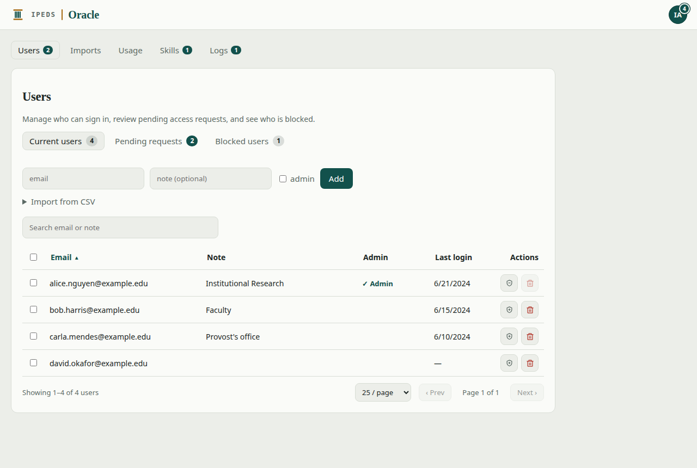
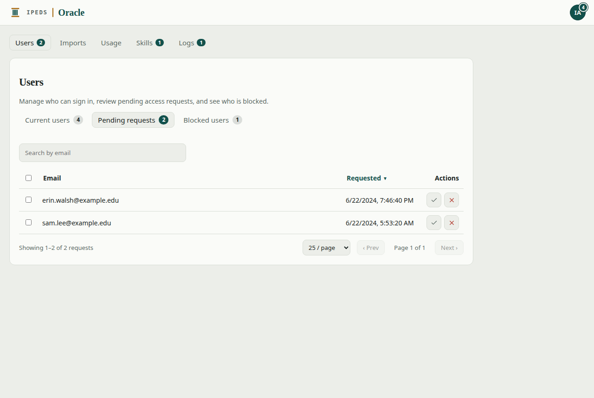
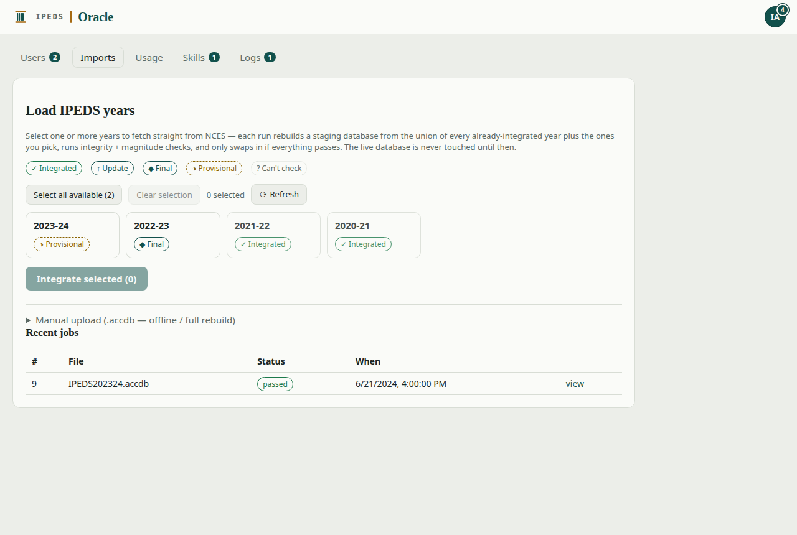
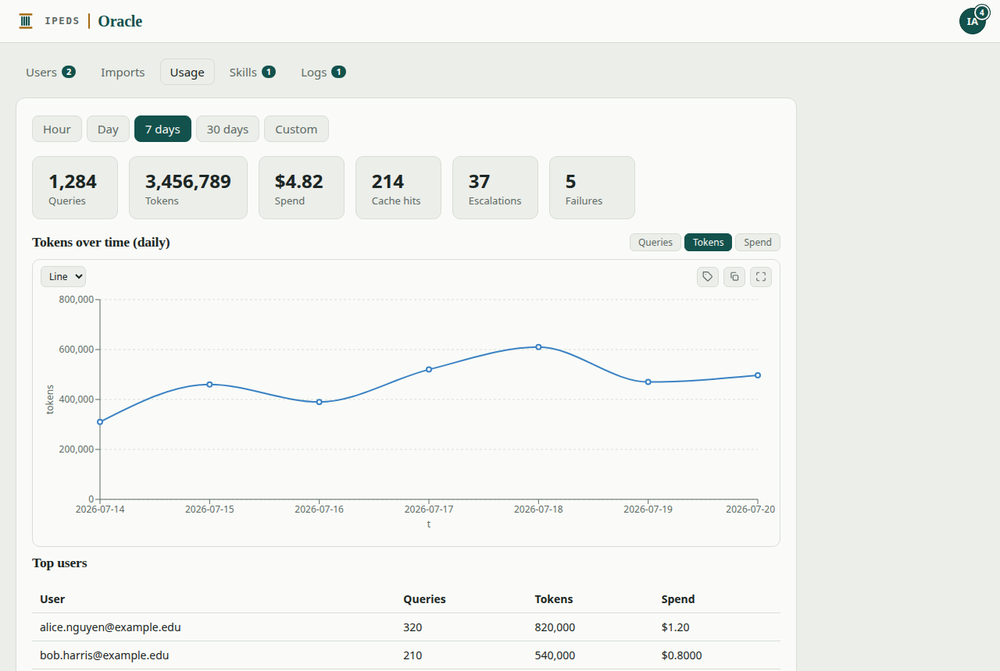
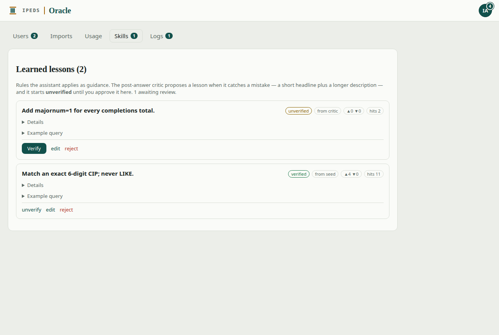
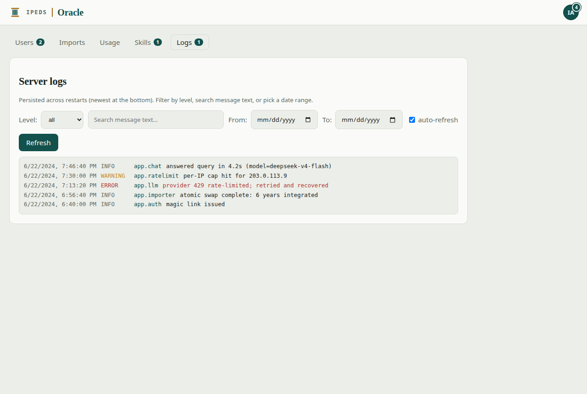

# Administering IPEDS Oracle

This guide covers the **Admin** tools. It assumes you already know how to use the
app day-to-day — if not, start with the [User guide](USER_GUIDE.md).

As an administrator you can approve and manage who has access, load new IPEDS
years, watch usage and cost, curate what the assistant has learned, and review
server logs. Everything lives under **Admin**, reachable from your account menu
(the avatar in the top-right → **Admin**).

> **Deploying** the app (Docker, configuration, email, backups) is a separate
> topic — see the **Self-hosting** section of the [README](../README.md).

---

## Contents

- [The attention badges](#the-attention-badges)
- [Users: allowlist and access requests](#users-allowlist-and-access-requests)
- [Imports: loading IPEDS years](#imports-loading-ipeds-years)
- [Usage: activity and cost](#usage-activity-and-cost)
- [Skills: what the assistant has learned](#skills-what-the-assistant-has-learned)
- [Logs](#logs)

---

## The attention badges

You never have to go hunting for work. A small **count badge** appears wherever
something is waiting for you:

- On your **avatar** (visible on every page, including Chat) — the total across
  all areas.
- On each **Admin section** in the nav — **Users** (pending access requests),
  **Skills** (unverified lessons), and **Logs** (new problems since you last
  looked).



The badges update on their own, and clear as soon as you act on what they point
to. Imports and Usage never badge — there's nothing to "clear" there.

---

## Users: allowlist and access requests

The **allowlist is the sole authority on who can sign in.** The Users section has
three sub-tabs, each with its own count:

- **Current users** — everyone approved to sign in.
- **Pending requests** — people who've asked for access.
- **Blocked users** — addresses you've denied.

### Adding people

On **Current users** you can:

- **Add** a single address (with an optional note), or
- **Import from CSV** to onboard a roster at once.

Either way, the person gets a friendly *"you're approved"* email pointing them at
the sign-in page — approval itself never emails a sign-in link; people request
their own one-time link when they're ready.

Each row shows the note, whether the person is an admin, and their last sign-in.
The action buttons **promote/demote** an admin or **remove** a user. Tick the
checkboxes to act on **many rows at once** (promote, demote, or remove in bulk).

> You can't remove or demote **yourself**, and you can't remove another admin
> without demoting them first — a guard against locking everyone out.

### Approving or declining requests

**Pending requests** lists everyone waiting. **Approve** to let someone in;
**Reject** to block them.



A rejection blocks that address **and all of its variants** (`+tag` and
letter-case forms), and a blocked address can't file new requests or reach your
inbox again. Bulk approve/reject works here too.

### Unblocking

**Blocked users** lists every denied address. Its undo control **removes the
block** — returning the address to a clean, never-requested state. That grants no
access and sends no email; the person can request access again if they wish.
(Approving a blocked address on the allowlist also lifts the block, and *does*
grant access.)

---

## Imports: loading IPEDS years

The dataset is a stack of IPEDS collection years, and you control which years are
loaded. The **Imports** tab shows a live catalog of what the U.S. Department of
Education has released.



Each year is a card:

- **Integrated** — already loaded (and queryable).
- **Final** / **Provisional** — released and available to add; tick the ones you
  want.
- Unavailable years are shown but not selectable.

Select the years you want and **Integrate** them. Behind the scenes the app
downloads the source files, builds a **fresh copy** of the whole database in
staging, runs integrity and magnitude checks, and **atomically swaps** it in only
if the checks pass — so the live data is never disturbed mid-import, and a bad
import can't corrupt what's already there. A progress bar tracks the rebuild.

- **Remove a year** with its trashcan control — the same safe staging-and-swap
  process runs in reverse, fully offline.
- **Manual upload** — if you'd rather provide the source `.accdb` file yourself
  (for a year not in the catalog, or an air-gapped setup), expand **Manual
  upload** and drop the file in. It runs through the same checks.

Once a year is integrated, the assistant picks it up automatically — no restart.

---

## Usage: activity and cost

The **Usage** tab summarizes how the app is being used over a time range you
choose (hour / day / 7 days / 30 days / custom):



- **Totals** — queries, tokens, spend, the three cache stats below, escalations, and
  failures.
- **A trend chart** — queries, tokens, or spend over time (switch with the toggle;
  the chart has the same controls as any answer chart, including image copy).
- **Top users** — the busiest accounts, by queries, tokens, and spend.

### Where "Spend" comes from (and what to do if it reads $0)

Spend is **not** computed from a price list we maintain — it's the **actual dollar
cost the LLM provider reports for each request** (OpenRouter returns it per call),
summed over the window. That means it's always current: switch models, or the
provider changes its rates, and Spend follows automatically with nothing to update.

The catch: reporting cost this way is an **OpenRouter** feature. If you point
`LLM_BASE_URL` at a provider that doesn't return a per-request cost (DeepSeek-direct,
a self-hosted gateway, most raw OpenAI-compatible endpoints), **Spend reads $0** —
not because nothing was spent, but because nobody told the app the price. Token
counts still populate; only the dollar figure is blank.

To get spend back in that case, set your model's list prices in `.env` and the app
will **estimate** the cost from token counts:

```
LLM_INPUT_COST_PER_MTOK=0.27    # USD per 1,000,000 prompt (input) tokens
LLM_OUTPUT_COST_PER_MTOK=1.10   # USD per 1,000,000 completion (output) tokens
```

Leave both unset (the default) whenever the provider reports real cost — the
provider's figure always wins; the estimate only fills in when the reported cost is
0. Two caveats on the estimate: it uses the prices **you** enter, so keep them in
sync with your provider if they change (unlike the reported cost, this one *can* go
stale), and it prices every prompt token at the input rate **without** the
cached-prefix discount, so it slightly over-states spend when the **Prompt cache**
rate is high.

### The three caches (they mean different things)

The dashboard shows **three** cache figures — don't confuse them:

- **Answer cache** — a *count* of questions answered straight from the app's own
  semantic cache of past answers, with **no LLM call at all**. A repeat or
  near-repeat question is served instantly and for free.
- **Schema cache** — a *percentage* measured on the **first** model call of each
  question: how much of that call's prompt the LLM provider served from **its own
  cache**. Every request carries a large, identical block of schema instructions up
  front, and the first call is the clean signal for whether that block is being
  reused *across* questions and users. **This is the number to watch** — a healthy,
  busy deployment runs it high, and that reuse is what keeps sending the full schema
  on every request cheap.
- **Prompt cache** — the same idea as Schema cache, but *blended across every model
  call of every question* (a hard question makes several calls as the assistant
  works through the data). It's the truest **cost** figure — it reflects the actual
  billing discount — but it runs higher than Schema cache because those follow-on
  calls also reuse the growing within-question conversation, not just the schema. Use
  Prompt cache to gauge spend; use **Schema cache** to judge whether the schema
  prefix itself is being amortized.

> **Watch the Schema cache rate.** If it sits low over a range with real traffic,
> the provider isn't reusing the schema prefix and you're paying close to full price
> for it on every question. The usual cause is **routing**, explained next.

> **Routing caveat — switching models/providers blows the cache away.** Prompt
> caching lives on the provider's servers and is *node-local*: a cached prefix on
> one machine is invisible to another. If your gateway (e.g. OpenRouter) spreads
> requests across several upstream providers, the cache lapses between bursts (common
> on a quiet, low-traffic pilot), or you **change the model or `LLM_BASE_URL`**, the
> rate drops even though the prompt text is byte-for-byte identical. For steady
> reuse: keep the model stable, and pin a single provider (OpenRouter's
> `provider.order` / `only`) or talk to one provider directly. A persistently low
> rate is a signal to check your routing — not the schema.

> **Privacy by design.** Usage shows only aggregates. The **text of people's
> questions is never shown here** — that would be an attributable privacy leak.
> Use this to watch cost and load, not to read what people asked.

---

## Skills: what the assistant has learned

The assistant improves over time by keeping short **lessons** — a generalized rule
plus a worked SQL example — that it recalls when answering similar questions.



Lessons are proposed automatically (when the built-in reviewer catches and fixes a
mistake) and start **unverified**. Your job is to curate them:

- **Verify** a lesson you trust, so it's used with confidence.
- **Edit** a headline or description to sharpen it.
- **Delete** anything wrong or unhelpful.

Each lesson shows its headline, the fuller description (expandable), and a
commented SQL example, formatted and syntax-highlighted. Good, verified lessons
make future answers faster and more accurate.

---

## Logs

The **Logs** tab is a live view of recent server activity — startups, queries,
imports, email delivery, rate-limit events, and any warnings or errors.



Entries are color-coded by level (INFO / WARNING / ERROR). The **Logs** attention
badge counts **problems (warnings and errors) since you last opened this tab**, so
it's easy to notice when something needs a look; opening Logs clears it and it
re-counts only later problems. It's the first place to check if a user reports
that email isn't arriving or a query behaved oddly.
