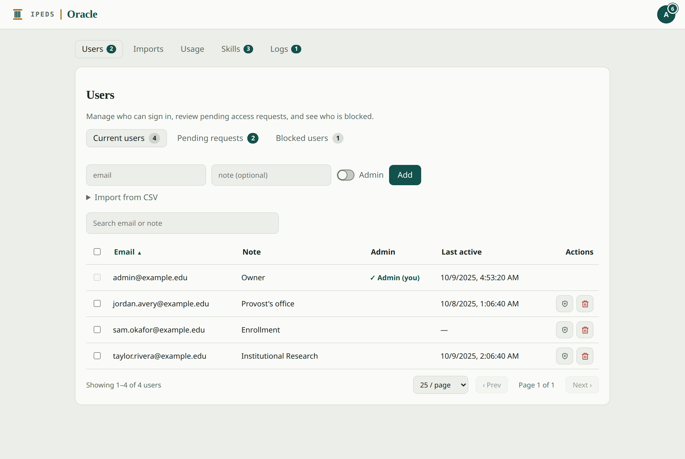
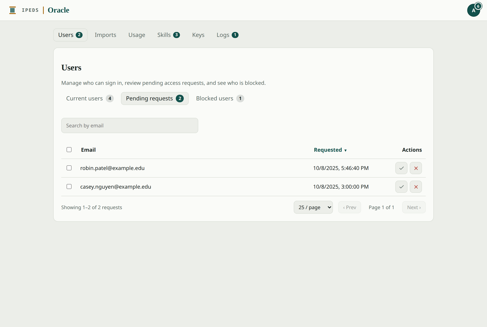
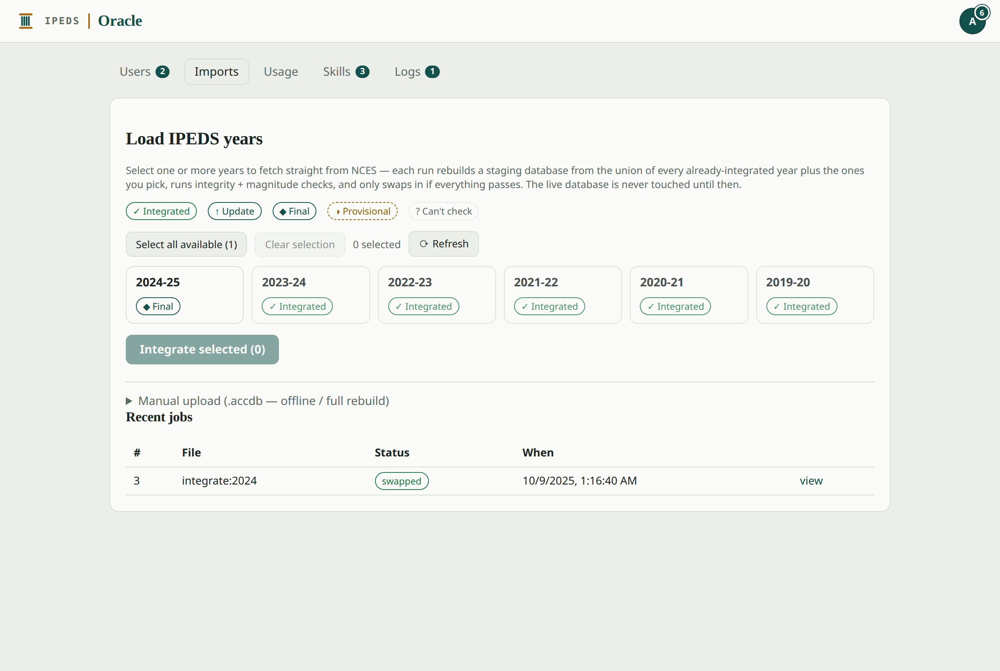
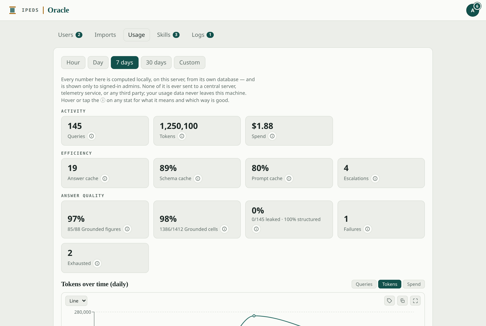
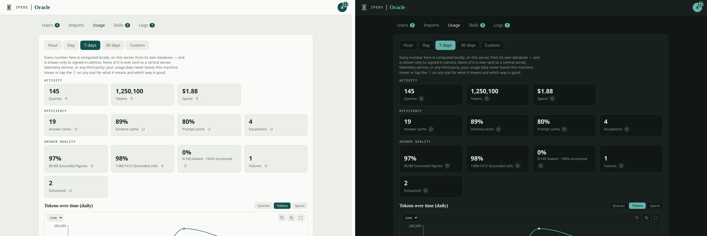
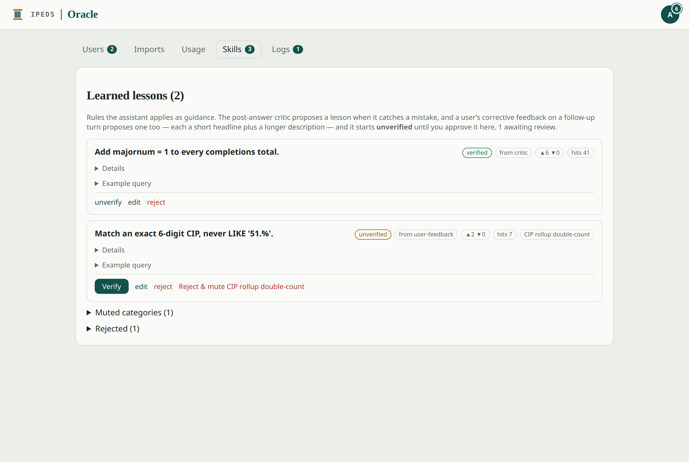
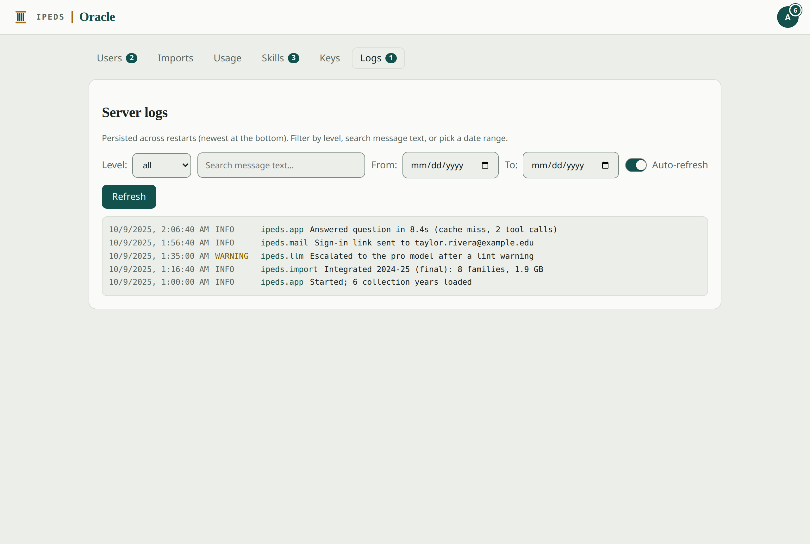

# Administering IPEDS Oracle

This guide covers the **Admin** tools. It assumes you already know how to use the
app day-to-day — if not, start with the [User guide](USER_GUIDE.md).

As an administrator you can approve and manage who has access, load new IPEDS
years, watch usage and cost, curate what the assistant has learned, issue and
revoke API keys, and review server logs. Everything lives under **Admin**, reachable from your account menu
(the avatar in the top-right → **Admin**).

> **Deploying** the app (Docker, configuration, email, backups) is a separate
> topic — see the **Self-hosting** section of the [README](../README.md).

---

## Contents

- [The attention badges](#the-attention-badges)
- [Users: allowlist and access requests](#users-allowlist-and-access-requests)
- [Imports: loading IPEDS years](#imports-loading-ipeds-years)
- [Usage: activity and cost](#usage-activity-and-cost)
- [Skills: what the assistant has learned](#skills-what-the-assistant-has-learned)
- [Keys: API access for other tools](#keys-api-access-for-other-tools)
- [Logs](#logs)
- [Keeping up to date](#keeping-up-to-date)

---

## The attention badges

You never have to go hunting for work. A small **count badge** appears wherever
something is waiting for you:

- On your **avatar** (visible on every page, including Chat) — the total across
  all areas.
- On each **Admin section** in the nav — **Users** (pending access requests),
  **Skills** (unverified lessons), and **Logs** (new problems since you last
  looked).



The badges update on their own, and clear as soon as you act on what they point
to. Imports and Usage never badge — there's nothing to "clear" there.

---

## Users: allowlist and access requests

The **allowlist is the sole authority on who can sign in.** The Users section has
three sub-tabs, each with its own count:

- **Current users** — everyone approved to sign in.
- **Pending requests** — people who've asked for access.
- **Blocked users** — addresses you've denied.

### Adding people

On **Current users** you can:

- **Add** a single address (with an optional note), or
- **Import from CSV** to onboard a roster at once.

Either way, the person gets a friendly *"you're approved"* email pointing them at
the sign-in page — approval itself never emails a sign-in link; people request
their own one-time link when they're ready.

Each row shows the note, whether the person is an admin, and when they were
**last active** — the most recent of their sign-in, their latest conversation,
and their latest question, with the date *and* time. Sort by that column to find
accounts worth offboarding; someone who was allowlisted and never came reads as
**—**.

> "Last active" tracks things people *do*, not pages they open. A colleague who
> signs in and only re-reads old answers shows their sign-in time, not the
> browsing — so treat a stale date as "hasn't asked anything lately", which is
> usually the question you're actually asking.

The action buttons **promote/demote** an admin or **remove** a user. Tick the
checkboxes to act on **many rows at once** (promote, demote, or remove in bulk).

> You can't remove or demote **yourself**, and you can't remove another admin
> without demoting them first — a guard against locking everyone out.

### Approving or declining requests

**Pending requests** lists everyone waiting. **Approve** to let someone in;
**Reject** to block them.



A rejection blocks that address **and all of its variants** (`+tag` and
letter-case forms), and a blocked address can't file new requests or reach your
inbox again. Bulk approve/reject works here too.

### Unblocking

**Blocked users** lists every denied address. Its undo control **removes the
block** — returning the address to a clean, never-requested state. That grants no
access and sends no email; the person can request access again if they wish.
(Approving a blocked address on the allowlist also lifts the block, and *does*
grant access.)

---

## Imports: loading IPEDS years

The dataset is a stack of IPEDS collection years, and you control which years are
loaded. The **Imports** tab shows a live catalog of what the U.S. Department of
Education has released.



Each year is a card:

- **Integrated** — already loaded (and queryable).
- **Final** / **Provisional** — released and available to add; tick the ones you
  want.
- Unavailable years are shown but not selectable.

Select the years you want and **Integrate** them. A confirmation appears first,
because this is a bigger operation than "add a year" sounds: **every import is a
full rebuild from all the years you have**, not an incremental merge. The dialog
tells you the real shape of the job — how many years in total, how many are
already loaded, how many are new, and roughly how much will be downloaded — and
reminds you that the live database keeps answering questions until the new one
passes every check.

Behind the scenes the app downloads the source files, builds a **fresh copy** of
the whole database in staging, runs integrity and magnitude checks, and
**atomically swaps** it in only if the checks pass — so the live data is never
disturbed mid-import, and a bad import can't corrupt what's already there. A
progress bar tracks the rebuild.

While a rebuild is running the tab **locks**: the year cards, the Integrate
button, the trashcan controls and the manual upload all stop responding, and a
notice says so. This holds for a job **another admin started**, or one that was
already running when you opened the tab — in that case the notice says so
explicitly ("An import started by another session is running…"), so a locked
screen never looks like a broken one. The lock clears itself when the job
finishes.

- **Remove a year** with its trashcan control — the same safe staging-and-swap
  process runs in reverse, fully offline. It confirms first too, and it cannot
  be undone without re-integrating the year.
- **Manual upload** — if you'd rather provide the source `.accdb` file yourself
  (for a year not in the catalog, or an air-gapped setup), expand **Manual
  upload** and drop the file in. It runs through the same checks.

Once a year is integrated, the assistant picks it up automatically — no restart.

---

## Usage: activity and cost

The **Usage** tab summarizes how the app is being used over a time range you
choose (hour / day / 7 days / 30 days / custom):



*The admin console follows your light/dark preference too:*



- **Totals** — queries, tokens, spend, the three cache stats below, escalations, and
  failures.
- **A trend chart** — queries, tokens, or spend over time (switch with the toggle;
  the chart has the same controls as any answer chart, including image copy).
- **Top users** — the busiest accounts, by queries, tokens, and spend.

### Where "Spend" comes from (and what to do if it reads $0)

Spend is **not** computed from a price list we maintain — it's the **actual dollar
cost the LLM provider reports for each request** (OpenRouter returns it per call),
summed over the window. That means it's always current: switch models, or the
provider changes its rates, and Spend follows automatically with nothing to update.

The catch: reporting cost this way is an **OpenRouter** feature. If you point
`LLM_BASE_URL` at a provider that doesn't return a per-request cost (a vendor's own
API, a self-hosted gateway, most raw OpenAI-compatible endpoints), **Spend reads $0** —
not because nothing was spent, but because nobody told the app the price. Token
counts still populate; only the dollar figure is blank. When the app detects this
(real activity, but no cost recorded and no fallback prices set), it shows a **yellow
warning** at the top of the Usage tab so a silent $0 never looks like "free." The
warning clears on its own once cost data starts arriving or you set the prices below.

To get spend back in that case, set your model's list prices in `.env` and the app
will **estimate** the cost from token counts:

```
LLM_INPUT_COST_PER_MTOK=0.14      # USD per 1,000,000 prompt (input) tokens
LLM_OUTPUT_COST_PER_MTOK=0.28     # USD per 1,000,000 completion (output) tokens
LLM_CACHE_READ_COST_PER_MTOK=0.0028   # per 1,000,000 tokens served from the cache
```

Leave them unset (the default) whenever the provider reports real cost — the
provider's figure always wins; the estimate only fills in when the reported cost
is 0.

**Set the cache-read price if you set the other two.** Providers discount a prompt
token they served from their own prefix cache very steeply (DeepSeek charges
$0.0028 against $0.140 for a miss — 50x), and this app is cache-heavy by design:
the whole schema rides every prompt, and a typical deployment runs near 80% on the
**Prompt cache** stat. Leaving the cache price at 0 prices those tokens at the full
input rate and over-states spend **several-fold** — measured at 5x on real traffic
here. A `0` means *not configured*, not "cache reads are free".

Two things the estimate still can't do: it uses the prices **you** enter, so keep
them in sync with your provider (unlike the reported cost, this one *can* go
stale); and one price pair covers both `MODEL_DEFAULT` and `MODEL_ESCALATION`, so
escalated turns are priced at the default model's rate.

Spend that came from the estimate is marked with a leading **~** on the Usage tab,
and the tile's label says how many of the window's turns were estimated — so an
estimate never reads like an invoice.

> **Note after switching providers or setting the cache price:** historical rows
> keep whatever cost was recorded at the time, so the spend trend can step sharply
> up or down on the day you changed it. That's the old rows being priced the old
> way, not a change in what you're actually paying.

### The three caches (they mean different things)

The dashboard shows **three** cache figures — don't confuse them:

- **Answer cache** — a *count* of questions answered straight from the app's own
  semantic cache of past answers, **without running the agent**. A repeat or
  near-repeat question is served instantly and for a small fraction of the usual
  cost — not for nothing: the topical guard screens *every* question before the
  cache is consulted, so a hit still pays for that one call. The cache is **scoped to
  the person who asked**: one colleague's stored answer is never replayed to
  another, since the prose is theirs and could reveal what they asked. That
  deliberately lowers the hit rate — a popular question is answered once per
  person rather than once per deployment.
- **Schema cache** — a *percentage* measured on the **first** model call of each
  question: how much of that call's prompt the LLM provider served from **its own
  cache**. Every request carries a large, identical block of schema instructions up
  front, and the first call is the clean signal for whether that block is being
  reused *across* questions and users. **This is the number to watch** — a healthy,
  busy deployment runs it high, and that reuse is what keeps sending the full schema
  on every request cheap.
- **Prompt cache** — the same idea as Schema cache, but *blended across every model
  call of every question* (a hard question makes several calls as the assistant
  works through the data). It's the truest **cost** figure — it reflects the actual
  billing discount — but it runs higher than Schema cache because those follow-on
  calls also reuse the growing within-question conversation, not just the schema. Use
  Prompt cache to gauge spend; use **Schema cache** to judge whether the schema
  prefix itself is being amortized.

- **Grounded figures** — a *percentage*, and the one **data-integrity** stat here
  rather than a cost one. Every answer that leads with a hero figure (the big
  typeset number above the prose) gets that number checked against the rows the
  app's own queries actually returned: it counts as grounded if the value appears
  in the data verbatim, matches at the rounding the answer displayed, or is
  correctly derived from a column (a total, an average, a percentage change, a
  share of the total). Answers with no hero figure — and answers whose figure
  isn't a number, like a leading institution's *name* — aren't counted either
  way, so a quiet range reads "—" rather than a falsely perfect 100%.
  You may also see a **"· N suppressed"** note beside this stat. Those are answers
  where the app asked the model for a missing headline figure, could not reproduce
  the number it came back with, and **withheld it** — nobody was shown that figure.
  They sit outside the percentage on purpose (there was no figure to get right or
  wrong), but the count is worth watching: a rising number means the app is
  repeatedly prompting for a headline the data cannot support, which usually points
  at a question shape that has no single summarizing number.

> **A rate below 100% means figures reached people that the app could not
> reproduce from its own data.** The underlying number is written by the language
> model, which transcribes it out of the query results — so a slip is possible,
> and this is the measurement that makes it visible. A one-off is worth a look; a
> persistent gap is worth reporting.

Three more integrity/telemetry stats sit alongside Grounded figures:

- **Grounded cells** — the same idea as Grounded figures, extended to the
  *results table*. Every number in a table's measure columns is checked back
  against the rows the app's own queries returned; this is the share that
  reproduce. (Rank and label columns aren't counted — only the data.) It's a
  cell-level transcription-accuracy signal for the densest block of numbers on
  screen.
- **Answer leaks** — a *count* of answers where stray formatting debris (a bit of
  raw chart/figure markup the model mis-wrapped) was **caught and removed before
  the answer shipped**. It reads how often that safety net fired, not how often
  something reached a user.
- **Exhausted** — a *count* of questions that used up the whole tool budget before
  the assistant could answer (with a `· N degraded` sub-label for the few whose
  numbers couldn't be grounded and were replaced with an honest "couldn't
  complete" message). A rising count is the signal to raise `LLM_MAX_TOOL_ITERS`.

> **Watch the Schema cache rate.** If it sits low over a range with real traffic,
> the provider isn't reusing the schema prefix and you're paying close to full price
> for it on every question. The usual cause is **routing**, explained next.

> **Routing caveat — switching models/providers blows the cache away.** Prompt
> caching lives on the provider's servers and is *node-local*: a cached prefix on
> one machine is invisible to another. If your gateway (e.g. OpenRouter) spreads
> requests across several upstream providers, the cache lapses between bursts (common
> on a quiet, low-traffic pilot), or you **change the model or `LLM_BASE_URL`**, the
> rate drops even though the prompt text is byte-for-byte identical. For steady
> reuse: keep the model stable, and pin a single provider (OpenRouter's
> `provider.order` / `only`) or talk to one provider directly. A persistently low
> rate is a signal to check your routing — not the schema.

> **Privacy by design.** Usage shows only aggregates. The **text of people's
> questions is never shown here** — that would be an attributable privacy leak.
> Use this to watch cost and load, not to read what people asked.

---

## Skills: what the assistant has learned

The assistant improves over time by keeping short **lessons** — a generalized rule
plus a worked SQL example — that it recalls when answering similar questions.



Lessons are proposed automatically from two sources, and start **unverified**:
the built-in reviewer (when it catches and fixes a mistake), and a user's own
**corrective feedback** on a follow-up turn (e.g. "you should have kept the
bachelor's scope" or "you could have asked me a clarifying question") — each
lesson's "from …" tag shows which. Your job is to curate them:

- **Verify** a lesson you trust, so it's used with confidence.
- **Edit** a headline or description to sharpen it.
- **Delete** anything wrong or unhelpful.
- **Reject & mute** the *kind* of lesson you never want again (below).

Each lesson shows its headline, the fuller description (expandable), and a
commented SQL example, formatted and syntax-highlighted. Good, verified lessons
make future answers faster and more accurate.

### Category pills, and rejecting a whole kind of lesson

A lesson proposed by the reviewer carries a **category pill** naming the kind of
mistake it came from. Alongside the ordinary **Delete**, such a lesson offers
**Reject & mute** — one action that discards this lesson *and* stops the
assistant proposing any future lesson in the same category, until you unmute it.
Use it when the problem isn't the wording but the whole idea: a category that
keeps coming back and that you keep declining.

It confirms first, and says plainly that it changes future behaviour rather than
just this row.

Two collapsed sections at the bottom of the tab keep that reversible:

- **Muted categories (N)** — every category currently suppressed, each with an
  **Unmute** control. Always shown, even at zero, so the count is a live status
  rather than something that only appears once you've muted something.
- **Rejected (N)** — the lessons you've turned down. **Allow again** lets the
  assistant propose that idea afresh; it does **not** bring the lesson back
  (rejecting deleted it). **Clear all** does the same for every record at once
  and asks first. This list is what stops a rejected lesson being re-proposed
  forever, so an empty one means the assistant is free to suggest anything again.

Two things worth knowing. **Rejecting is remembered, deleting a verified rule is
too** — retiring a lesson you'd previously verified also means "don't suggest
this again", so it lands in Rejected as well. And lessons that were already in
the queue before this feature shipped have **no category**, so they show no pill
and offer no **Reject & mute**; ordinary Delete still works, and the backlog
clears itself as you work through it.

---

## Keys: API access for other tools

The **Keys** tab lists every API key in the deployment. A key lets an outside
program — Claude Code, a script, anything that speaks the Model Context Protocol
— ask IPEDS Oracle questions **as the person it belongs to**, over the app's
`/mcp` endpoint, instead of signing in through a browser.

Users mint their own keys from the account menu → **API keys**. This tab is for
the two things they can't do: seeing everybody's, and issuing one on someone's
behalf.

**Issuing a key.** Type the person's email, optionally a label, and select
**Create key**. The address has to be allowlisted *and* have signed in at least
once — a key attaches to an existing account, it doesn't create one. The key
appears once, in a dialog; copy it and send it to its owner over a channel you
trust, because nothing stores it and no one can look it up later.

**Reading the table.** Owner, label, the masked key (its last four characters),
the day it was created, the day it was last used, and its status. The masked
value is what lets you trace a key seen in a log or a config file back to its
owner. "Last used" is recorded at most once a minute, so it tells you the day,
not the second.

**Labels are the owner's.** You set one when you mint a key, and after that
only the key's owner can rename it, from their own **API keys** page. This table
shows whatever the label currently says.

**Revoking.** The trash-can button on a row revokes that key immediately. Any
client still using it stops working on its next call, and it can't be undone —
issue a new key instead. The row stays in the table marked **Revoked**, so a
withdrawn key is still there when you need to ask what it had access to. This
table is the only place it stays: the owner's own **API keys** page lists live
keys only, so a person who revokes a key sees it disappear.

Two things happen without you doing anything. Removing someone from the
allowlist **also stops their keys**, so offboarding through Admin → Users is
complete on its own. And an `ask` call through a key is a full-price question:
it appears in Admin → Usage with everything else and counts against that
person's usual per-question limit, so one person's spend is capped whichever way
they ask. A key that is spending more than you expect is revoked here without
touching that person's web access.

---

## Logs

The **Logs** tab is a live view of recent server activity — startups, queries,
imports, email delivery, rate-limit events, and any warnings or errors.



Entries are color-coded by level (INFO / WARNING / ERROR). The **Logs** attention
badge counts **problems (warnings and errors) since you last opened this tab**, so
it's easy to notice when something needs a look; opening Logs clears it and it
re-counts only later problems. It's the first place to check if a user reports
that email isn't arriving or a query behaved oddly.

---

## Keeping up to date

The **About** dialog (account menu → **About**) shows the version you're running
and the latest release available on GitHub. When a newer version exists, admins
also see a **banner in the Admin console** — "vX.Y.Z is available" with a link to
the release notes — and the same "something's waiting" count on your avatar badge.
The banner isn't dismissible: it's there until you're on the current release, so
an available update never quietly disappears.

The version check is cached, fails silently if GitHub can't be reached, and can be
turned off entirely (`UPDATE_CHECK_ENABLED=false`) if you'd rather the app make no
outbound calls to check — see the README's **Self-hosting** section for how to
update the running image.
