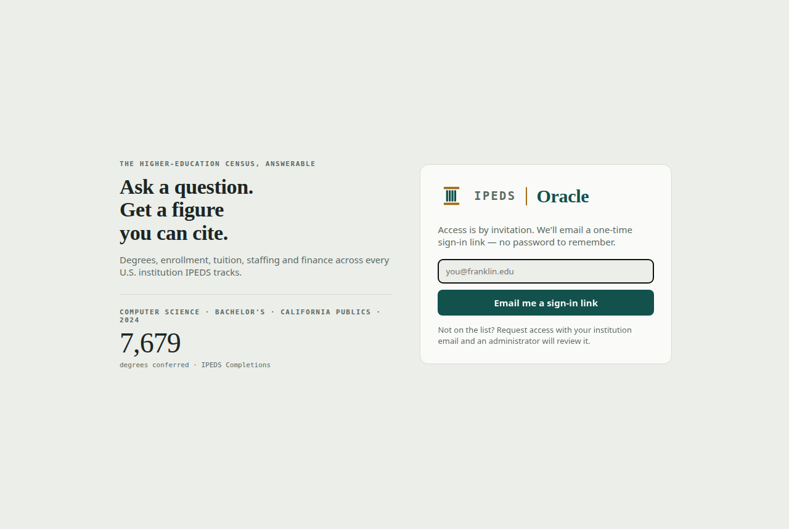
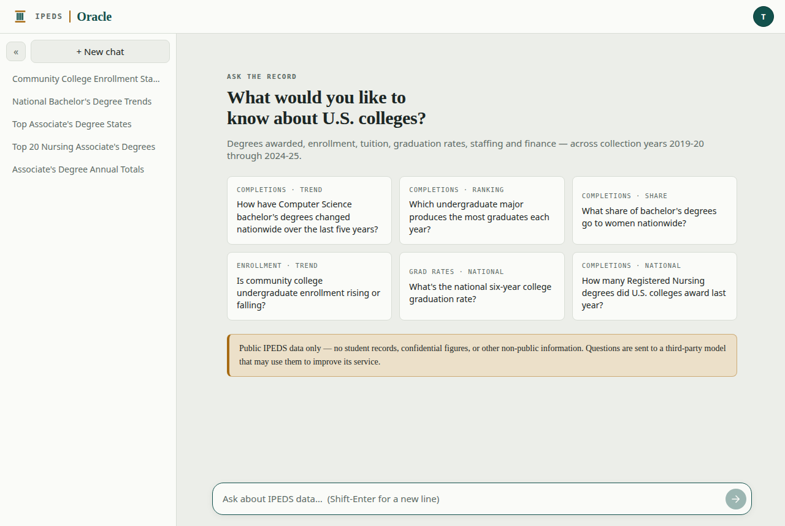
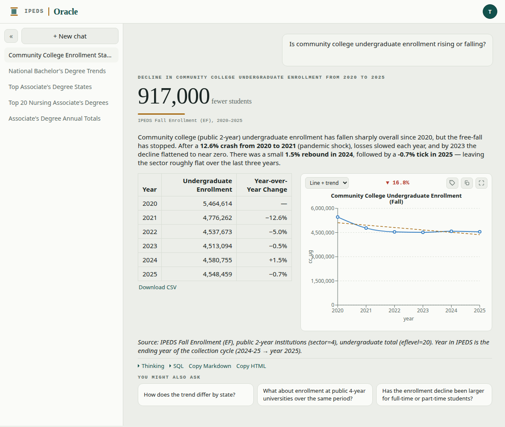
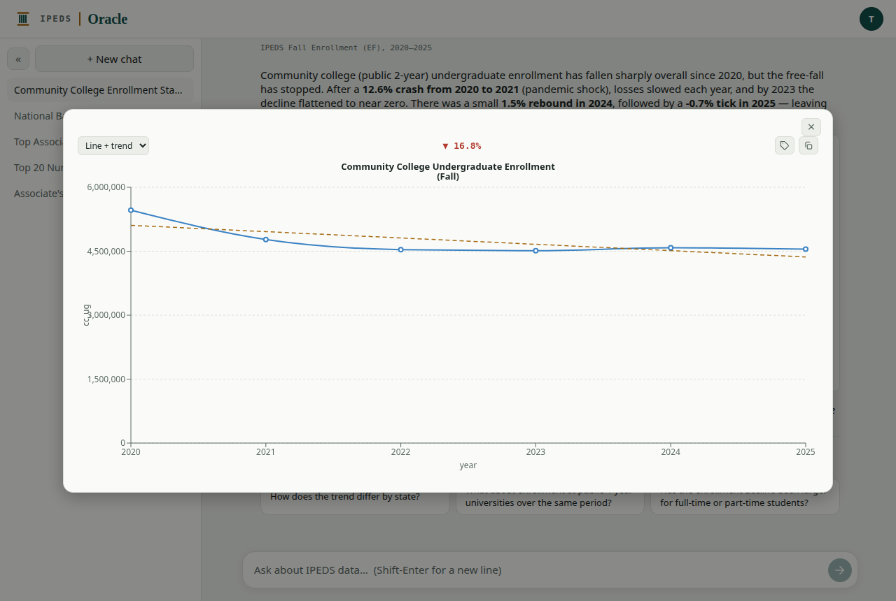
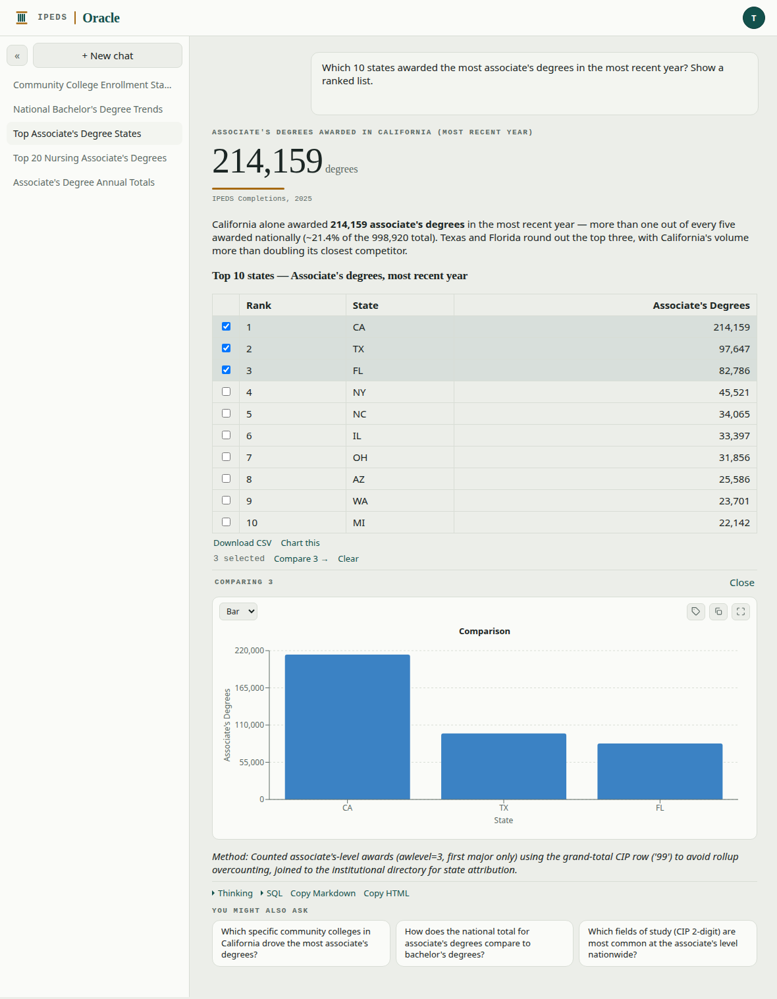
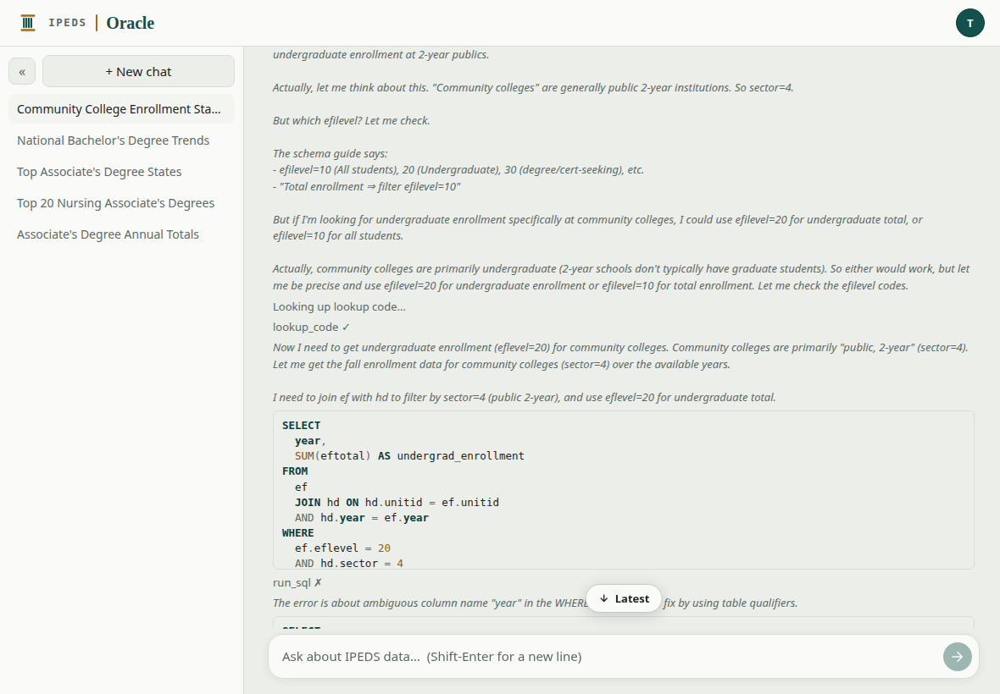
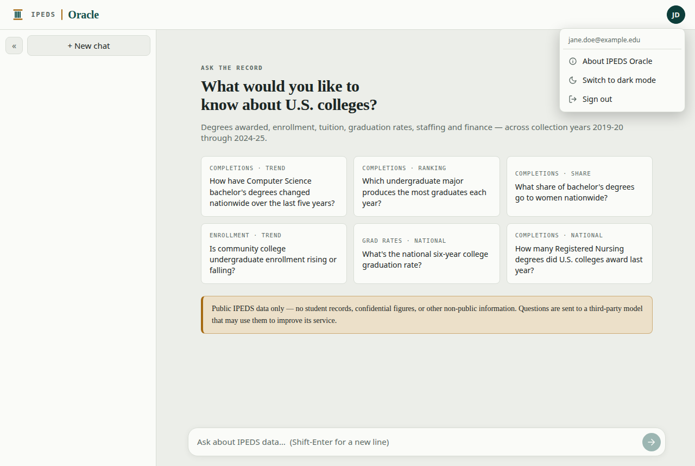

# Using IPEDS Oracle

**IPEDS Oracle** lets you explore U.S. college and university data — the U.S.
Department of Education's **IPEDS** census — just by asking questions in plain
English. No SQL, no spreadsheets, no program codes to memorize. You ask; an AI
agent writes and runs the query, sanity-checks the numbers, and streams back an
answer with the tables and charts behind it.

This guide walks through everything you can do. (Administrators have a few extra
tools — see the [Admin guide](ADMIN_GUIDE.md).)

---

## Contents

- [Signing in](#signing-in)
- [Asking a question](#asking-a-question)
- [Reading an answer](#reading-an-answer)
- [Charts](#charts)
- [Tables and CSV](#tables-and-csv)
- [Comparing rows](#comparing-rows)
- [Seeing the work: Thinking & SQL](#seeing-the-work-thinking--sql)
- [Copying an answer](#copying-an-answer)
- [Refining and following up](#refining-and-following-up)
- [Conversations](#conversations)
- [Your account menu](#your-account-menu)
- [Getting good answers](#getting-good-answers)

---

## Signing in

Access is by invitation, and there's **no password**. On the sign-in page, enter
your email address:

- If you've been approved, a **one-time sign-in link** arrives by email within a
  few seconds. Click it and you're in for about a month.
- If you haven't been approved yet, choose **Request access** — an administrator
  is notified and can approve you. Once approved, you'll get an email; come back
  and request your sign-in link.

---

## Asking a question

When you open the app (or start a **New chat**), you'll see a prompt and a few
example questions — the **query slips**. Click any slip to drop it into the box,
or just type your own question at the bottom and press **Enter** (use
**Shift+Enter** for a new line).

Ask the way you'd ask a colleague. A few to get you started:

- "How have Computer Science bachelor's degrees changed nationwide over the last
  five years?"
- "Which states award the most degrees in the health professions?"
- "What's the national six-year graduation rate?"
- "In a 60-mile radius of Columbus, Ohio, the top 5 universities graduating MBA
  students over 5 years."

You don't need to know table names or program codes — describe what you want and
the assistant figures out the rest.

---

## Reading an answer

The answer streams in as it's generated. A typical answer has several parts:

1. **The hero figure** — when one number captures the answer, it's typeset large
   at the top with its source (e.g. *917,000 fewer students · IPEDS Fall
   Enrollment, 2020–2025*).
2. **A short summary** — the direction and size of the change, the peak/trough
   years, and any provisional year, in a sentence or two.
3. **A results table** — the numbers behind the answer.
4. **A chart** — for trends and comparisons, rendered beside or below the table.
5. **A source/method note** — which survey and codes were used.
6. **Follow-up chips** — *"You might also ask…"* — one click asks the next
   question (see [Refining and following up](#refining-and-following-up)).

> **A note on accuracy.** The assistant sanity-checks magnitudes before
> answering, but it's a tool, not an oracle. For anything you'll publish or
> decide on, spot-check the result and use **Download CSV** or **Thinking → SQL**
> to verify the underlying numbers.

---

## Charts

Charts appear automatically for trends and comparisons (and you can add one to any
numeric table — see below). The small toolbar above a chart lets you:

- **Choose the chart type** from the dropdown — **Line**, **Bar**, or **Line +
  trend** (a line with a fitted trend line, when the data is a time series).
- **Toggle data labels** with the 🏷 tag button.
- **Copy the chart as an image** with the copy button — paste it straight into an
  email, document, or slide. It pastes as a clean image that looks right in light
  or dark mode.
- **Maximize** the chart with the ⤢ button to see it full size in its own window.

For a time-series line chart, a small **▲/▼ percentage badge** shows the change
over the whole range.

---

## Tables and CSV

Every result table has its own toolbar:

- **Download CSV** — export exactly that table.
- **Chart this** — when a table has a numeric column and the answer didn't
  already draw a chart, this renders one on demand.

Long tables scroll within their own area, so a wide table never breaks the page.

---

## Comparing rows

When an answer lists entities — states, institutions, programs — you can pick a
few and chart just those, instantly, right from the table. Tick the checkboxes on
2–4 rows, then click **Compare** to see a snapshot bar chart of only your
selection.

Nothing is re-queried — the comparison is built from the numbers already on
screen, so it's instant. Use **Clear** to start over.

---

## Seeing the work: Thinking & SQL

Every answer is backed by a real query you can inspect. Below the answer:

- **Thinking** expands the agent's reasoning — how it interpreted your question,
  which tables and codes it looked up, the SQL it ran, and any corrections it made
  along the way.
- **SQL** shows just the final query, formatted and syntax-highlighted.

This is how you check exactly what a number means before you rely on it.

---

## Copying an answer

Two buttons under each answer copy the whole thing:

- **Copy Markdown** — the answer as Markdown text.
- **Copy HTML** — the answer with its table and chart formatting preserved, so it
  pastes cleanly into **Word, Outlook, or Google Docs**.

---

## Refining and following up

You don't have to get the question perfect the first time.

- **Follow-up chips** — the *"You might also ask…"* suggestions under an answer
  drill deeper (by state, program, year, or a comparison). Click one and it's
  asked as a follow-up, keeping the thread's context.
- **Edit** or **Rerun** any of your earlier prompts — hover a question you asked
  and use the controls to reword or re-run it. The new answer **replaces** the old
  one in place, so a conversation stays clean as you refine.

---

## Conversations

Your conversations are saved in the **sidebar** on the left and named
automatically from your first question.

- Click any conversation to reopen it — answers, tables, charts, and the Thinking
  trace are all preserved.
- **Rename** a conversation inline to something memorable.
- **Delete** any you don't need.
- **Collapse** the sidebar (the « button) for more room.
- **New chat** starts a fresh thread.

---

## Your account menu

The round **avatar** in the top-right corner (your initials) opens your account
menu:

- **Light / dark mode** — toggle it here; your choice is remembered.
- **About** — what the app is, plus links to these guides.
- **Sign out**.

(Administrators also see an **Admin** entry here — see the
[Admin guide](ADMIN_GUIDE.md).)

---

## Getting good answers

- **Be specific about the level.** "Bachelor's degrees," "associate's degrees,"
  "certificates" — naming the award level gets you the right count.
- **Name the field or program** in plain words ("nursing," "computer science,"
  "the health professions"); you don't need CIP codes.
- **Say the time frame** ("last year," "over the last five years," "the most
  recent year").
- **Ask follow-ups.** It's often faster to start broad and drill in with the chips
  or a follow-up question than to write one perfect query.
- **Verify what matters.** Open **Thinking → SQL** or **Download CSV** for anything
  you'll cite.

Only **public IPEDS data** is available here — there are no student records or
confidential figures. Questions are answered by a third-party AI model, so don't
paste anything proprietary or confidential into the chat.
